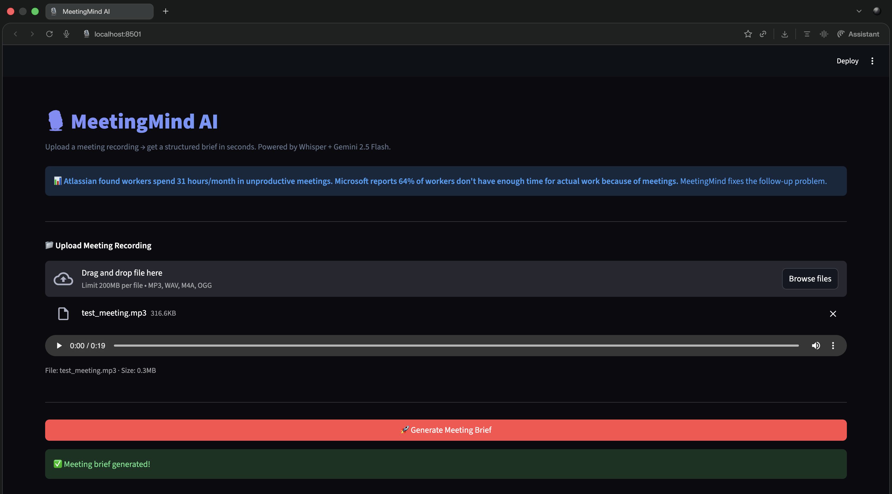
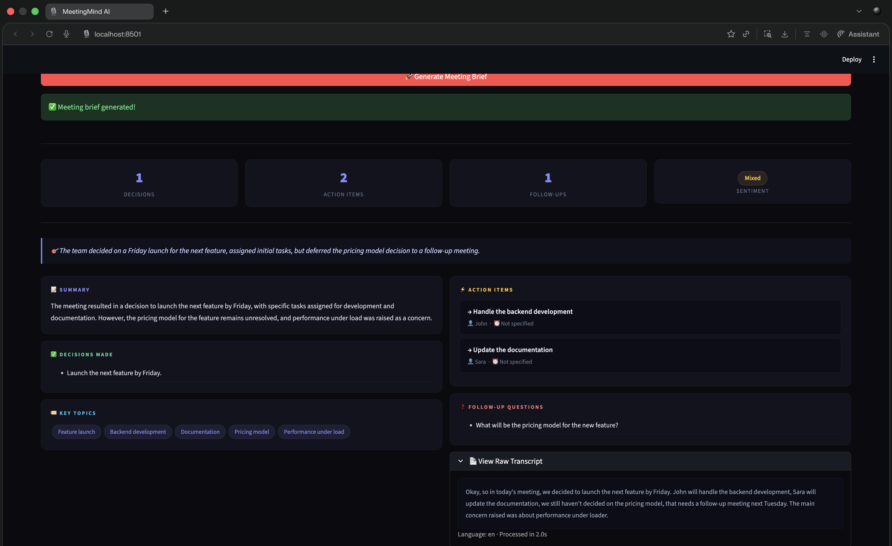

# 🎙️ MeetingMind AI

> Upload any meeting recording → get a structured brief with 
> decisions, action items, owners and follow-ups.
> Powered by Whisper (local) + Gemini 2.5 Flash.


---

## 🎯 Real World Problem

> **Atlassian State of Teams Report, 2023** — knowledge workers 
> spend 31 hours per month in unproductive meetings.
>
> **Microsoft Work Trend Index, April 2024** — 64% of workers 
> say they don't have enough time for focused work because of meetings.
>
> **Atlassian, 2023** — 47% of employees leave meetings unsure 
> of what they're supposed to do next.

Microsoft Teams and Google Meet solve the **recording problem.**
MeetingMind solves the **follow-through problem** — structured 
extraction of decisions, owners, and follow-ups from any audio source.

---

## ✨ Features

- 🎙️ Local transcription via faster-whisper (zero API cost)
- 🤖 Structured extraction via Gemini 2.5 Flash
- ✅ Decisions made — clearly listed
- ⚡ Action items with owner + deadline
- ❓ Follow-up questions that need resolution
- 📊 Meeting sentiment: Productive / Unresolved / Mixed
- 🏷️ Key topics auto-tagged
- 📄 Raw transcript in expandable view

---

## 🏗️ Architecture
```
Audio File (.mp3 / .wav / .m4a)
        ↓
faster-whisper (runs locally)
        ↓
Raw Transcript Text
        ↓
Gemini 2.5 Flash (structured extraction)
        ↓
Pydantic Model Validation
        ↓
Streamlit UI (brief card)
```

---

## 🛠️ Tech Stack

| Layer | Tool |
|---|---|
| Transcription | faster-whisper (local, free) |
| LLM | Google Gemini 2.5 Flash |
| Validation | Pydantic |
| UI | Streamlit |
| Language | Python 3.12 |

---

## 🚀 Run Locally
```bash
git clone https://github.com/YOUR_USERNAME/ai-portfolio
cd 02-meetingmind

# Activate shared venv
source ../venv/bin/activate  # Mac/Linux
..\venv\Scripts\activate     # Windows

pip install -r requirements.txt
echo "GEMINI_API_KEY=your_key" > .env

streamlit run ui.py
```

---

## 📸 Demo



---

## 🧠 What I Learned

- Multi-step pipelines: each step independent and testable
- faster-whisper runs fully locally — no API cost, no data privacy risk
- Sliding window pattern in audio chunking mirrors DSA concepts
- Pydantic nested models (ActionItem inside MeetingBrief)
- Handling real-world audio edge cases

---

## 📅 Day 2 of 14 — AI Build in Public Challenge

Follow the journey → [LinkedIn](https://www.linkedin.com/in/vedapraneeth/)