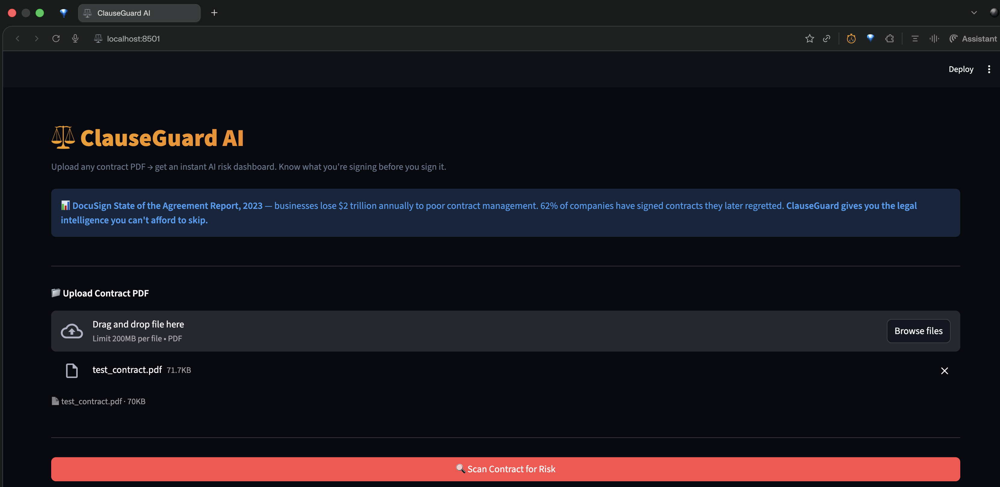
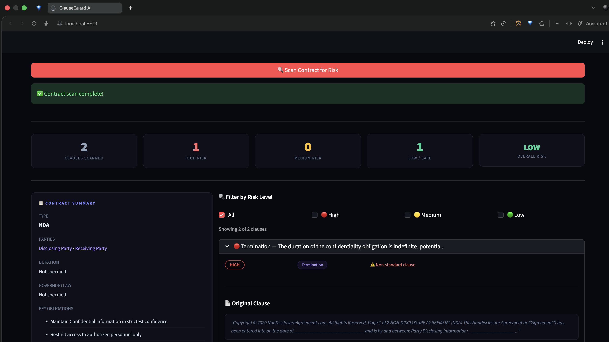
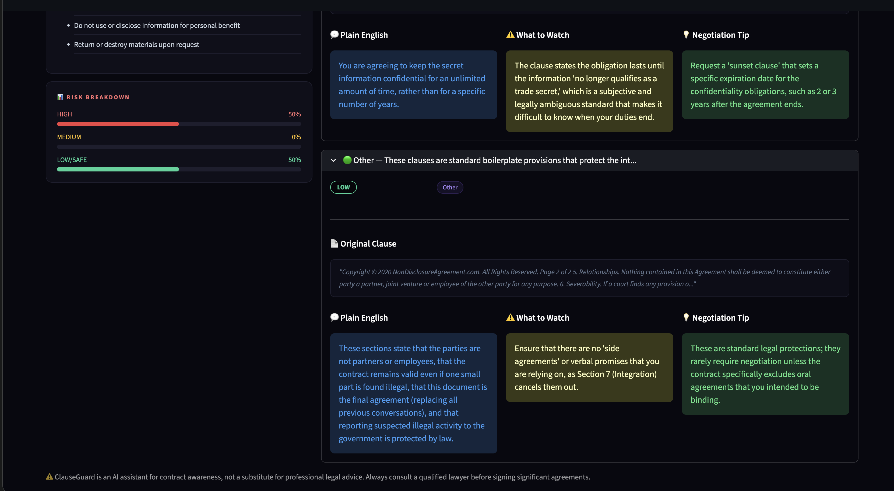

# ⚖️ ClauseGuard AI

> Upload any contract PDF → get an instant AI risk dashboard.
> Know exactly what you're signing before you sign it.
> Powered by RAG + Gemini 2.0 Flash.


---

## 🎯 Real World Problem

> **DocuSign State of the Agreement Report, 2023** —
> businesses lose $2 trillion annually to poor
> contract management. 62% of companies have signed
> contracts they later regretted.
>
> **Thomson Reuters Legal Tracker, 2023** —
> outside legal counsel costs an average of $900/hour.
> Small businesses and freelancers skip legal review
> entirely due to cost.
>
> **World Commerce & Contracting, 2022** —
> organizations lose 9% of annual revenue due to
> poor contract management.

ClauseGuard gives every freelancer and small business
the legal intelligence they can't afford to skip —
for free.

---

## ✨ Features

- 📄 PDF text extraction via PyMuPDF
- 🧩 Smart paragraph-based chunking
  (respects clause boundaries)
- 🔍 Semantic search via sentence-transformers
  (runs locally)
- 🤖 Per-clause risk analysis via Gemini 2.0 Flash
- 🔴 HIGH / 🟡 MEDIUM / 🟢 LOW risk classification
- 💬 Plain English explanation per clause
- 💡 Negotiation tip per risky clause
- ⚠️ Non-standard clause detection
- 📊 Risk breakdown dashboard

---

## 🏗️ Architecture
```
Contract PDF
     ↓
PyMuPDF (text extraction)
     ↓
Paragraph Chunker
     ↓
sentence-transformers (local embeddings)
     ↓
ChromaDB (local vector store)
     ↓
Gemini 2.0 Flash (per-clause risk scan)
     ↓
Pydantic validation
     ↓
Streamlit risk dashboard
```

---

## 🛠️ Tech Stack

| Layer | Tool |
|---|---|
| PDF Parsing | PyMuPDF |
| Chunking | Paragraph-based (custom) |
| Embeddings | sentence-transformers (local) |
| Vector DB | ChromaDB (local) |
| LLM | Gemini 2.0 Flash |
| Validation | Pydantic |
| UI | Streamlit |
| Language | Python 3.14 |

---

## 🚀 Run Locally
```bash
git clone https://github.com/vedap24/ai-portfolio
cd 03-clauseguard

source ../venv/bin/activate  # Mac/Linux
..\venv\Scripts\activate     # Windows

pip install -r requirements.txt
echo "GEMINI_API_KEY=your_key" > .env

streamlit run ui.py
```

---

## 📸 Demo




---

## 🧠 What I Learned

- RAG quality = chunking quality. Paragraph chunking
  beats token chunking for legal documents
- sentence-transformers runs 100% locally —
  zero embedding cost, zero data privacy risk
- Two-pointer pattern in DSA maps directly
  to chunk boundary detection
- Pydantic nested models for complex structured output
- Rate limit handling with exponential backoff

---

## ⚠️ Disclaimer

ClauseGuard is an AI tool for contract awareness,
not a substitute for professional legal advice.
Always consult a qualified lawyer before signing
significant agreements.

---

## 📅 Day 3 of 14 — AI Build in Public Challenge

Follow the journey →
[LinkedIn](https://www.linkedin.com/in/vedapraneeth/)

> Day 3 of 14 — ClauseGuard AI