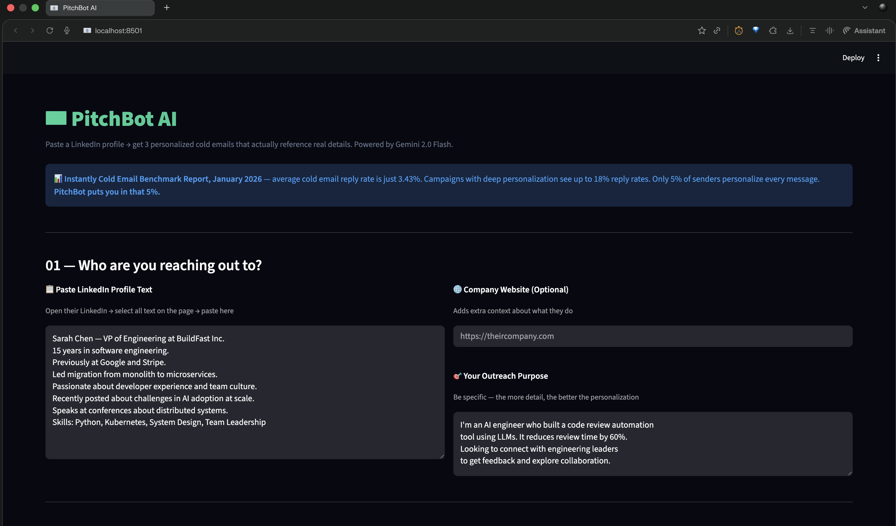
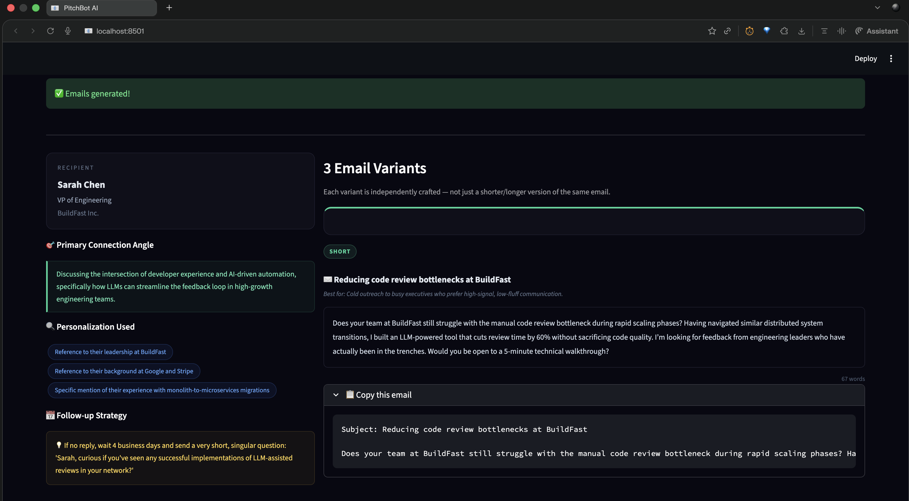
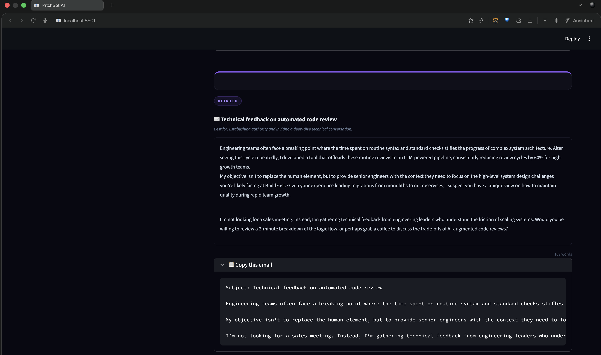

# 📧 PitchBot AI

> Paste a LinkedIn profile + your outreach purpose →
> get 3 personalized cold emails that reference
> real details about the recipient.
> Powered by a 3-step Gemini 2.0 Flash prompt chain.


---

## 🎯 Real World Problem

> **Instantly Cold Email Benchmark Report,
> January 2026** — platform-wide average reply
> rate across billions of cold emails: 3.43%.
> 19 out of 20 cold emails get completely ignored.
>
> **Saleshandy Benchmarks Report, February 2026
> (100M+ emails analyzed)** — campaigns with
> advanced personalization beyond first name
> see reply rates up to 18%. Only 5% of senders
> personalize every message.
>
> **Woodpecker Study, 2026** — adding personalized
> elements to both subject line and body increases
> reply rates by up to 142%.

The gap between 3% and 18% reply rate is not your
product. It's not your offer. It's one thing:
does this email feel written for me, or for anyone?

---

## ✨ Features

- 🔍 Profile insight extraction (name, role,
  challenges, trajectory, communication style)
- 🎯 Connection angle finder
  (primary + secondary angles)
- ✍️ 3 email variants: short / medium / detailed
- 🌐 Optional company page scraper for extra context
- 💡 Follow-up strategy tip
- 🔖 Personalization elements used — listed explicitly
- ✅ Input validation with clear error messages

---

## 🏗️ Architecture
```
LinkedIn Profile Text (pasted)
        ↓
[Optional] Company Page Scraper
        ↓
Step 1 — Profile Insight Extractor (Gemini)
        ↓
Step 2 — Connection Angle Finder (Gemini)
        ↓
Step 3 — Email Writer / 3 Variants (Gemini)
        ↓
Pydantic Validation
        ↓
Streamlit UI
```

---

## 🛠️ Tech Stack

| Layer | Tool |
|---|---|
| Web Scraping | requests + BeautifulSoup |
| LLM | Gemini 2.0 Flash |
| Prompt Chain | 3-step direct implementation |
| Validation | Pydantic |
| UI | Streamlit |
| Language | Python 3.12 |

---

## 🚀 Run Locally
```bash
git clone https://github.com/vedap24/ai-portfolio
cd 04-pitchbot

source ../venv/bin/activate  # Mac/Linux
..\venv\Scripts\activate     # Windows

pip install -r requirements.txt
echo "GEMINI_API_KEY=your_key" > .env

streamlit run ui.py
```

---

## 📸 Demo




---

## 🧠 What I Learned

- Chaining 3 small prompts beats 1 giant prompt
  every single time — more control, better output
- LinkedIn blocks scraping reliably — pasting
  profile text is faster AND more reliable
- The connection angle step is the most critical:
  without it, even personalized emails feel generic
- Fallback logic for missing email variants
  keeps the app stable in production
- Gemini 2.0 Flash handles tone shifts well —
  same content, different feel per variant

---

## 📅 Day 4 of 14 — AI Build in Public Challenge

Follow the journey →
[LinkedIn](https://www.linkedin.com/in/vedapraneeth/)