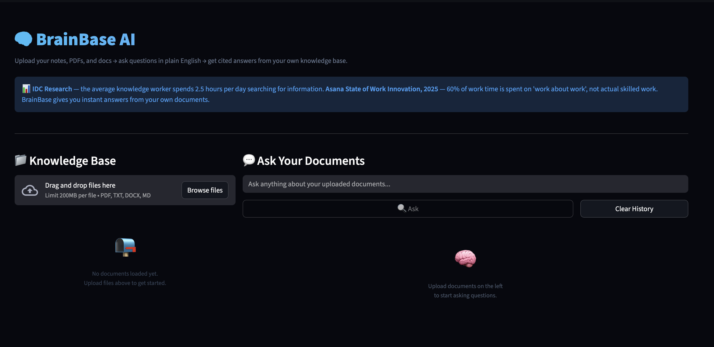

# 🧠 BrainBase AI

> Upload your notes, PDFs, and docs →
> ask questions in plain English →
> get cited answers from your own knowledge base.
> Powered by local embeddings + Gemini 2.0 Flash.


---

## 🎯 Real World Problem

> **IDC Research** — the average knowledge worker
> spends 2.5 hours per day — roughly 30% of their
> workday — searching for information across
> documents, emails, and apps.
>
> **Asana State of Work Innovation, 2025** —
> 60% of work time is spent on "work about work":
> searching for information, switching between apps,
> tracking down past decisions.
>
> **McKinsey Global Institute** — a robust knowledge
> management system reduces time lost searching
> by up to 35% and boosts productivity by 20–25%.

BrainBase turns your scattered documents into a
searchable, citable knowledge base you can query
in plain English — in under 60 seconds.

---

## ✨ Features

- 📄 Multi-format support: PDF, DOCX, TXT, MD
- 🧩 Smart paragraph-based chunking with overlap
- 🔍 Local semantic search via sentence-transformers
  (your docs never leave your machine)
- 🤖 Cited answers via Gemini 2.0 Flash
- 📎 Source citation with exact quote per answer
- 💡 Follow-up question suggestions
- 🗑️ Clear knowledge base anytime
- ✅ Confidence scoring: HIGH / MEDIUM / LOW

---

## 🏗️ Architecture
```
Documents (PDF / DOCX / TXT / MD)
         ↓
Format-specific parsers (PyMuPDF / python-docx)
         ↓
Paragraph chunker (512 tokens, 50-word overlap)
         ↓
sentence-transformers (local embeddings)
         ↓
ChromaDB (local vector store)
         ↓
Question → cosine similarity retrieval
         ↓
Gemini 2.0 Flash (answer + citation)
         ↓
Pydantic validation → Streamlit UI
```

---

## 🛠️ Tech Stack

| Layer | Tool |
|---|---|
| PDF Parsing | PyMuPDF |
| DOCX Parsing | python-docx |
| Chunking | Paragraph-based + overlap |
| Embeddings | sentence-transformers (local) |
| Vector DB | ChromaDB (local) |
| LLM | Gemini 2.0 Flash |
| Validation | Pydantic |
| UI | Streamlit |
| Language | Python 3.12 |

---

## 🚀 Run Locally
```bash
git clone https://github.com/vedap24/ai-portfolio
cd 05-brainbase

source ../venv/bin/activate  # Mac/Linux
..\venv\Scripts\activate     # Windows

pip install -r requirements.txt
echo "GEMINI_API_KEY=your_key" > .env

streamlit run ui.py
```

---

## 📸 Demo



---

## 🧠 What I Learned

- Multi-format parsing needs format-specific
  error handling — PDFs fail differently than DOCX
- Paragraph chunking with 50-word overlap prevents
  answer loss at chunk boundaries
- Binary search in DSA maps directly to vector
  similarity search — same principle of eliminating
  half the search space at each step
- Source citation = trust. Answers without sources
  feel like guesses. Answers with quotes feel like facts
- ChromaDB's duplicate ID check prevents
  re-embedding the same document twice

---

## 📅 Day 5 of 14 — AI Build in Public Challenge

Follow the journey →
[LinkedIn](https://linkedin.com/in/vedapraneeth)
