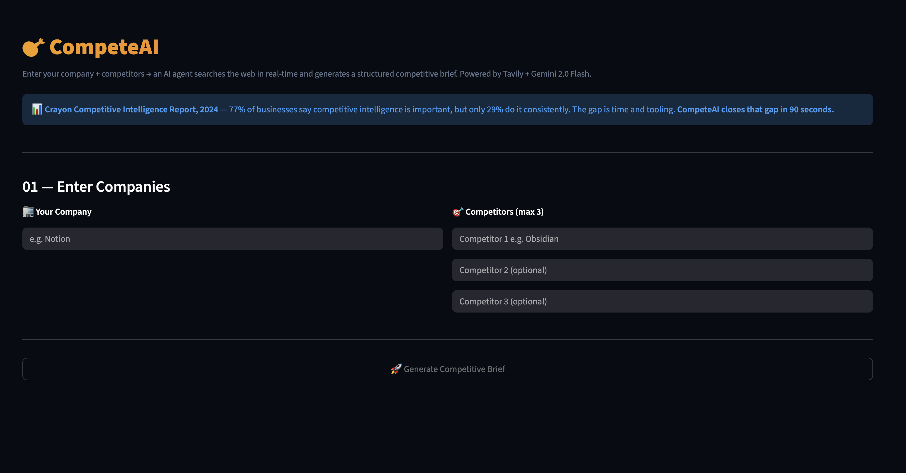
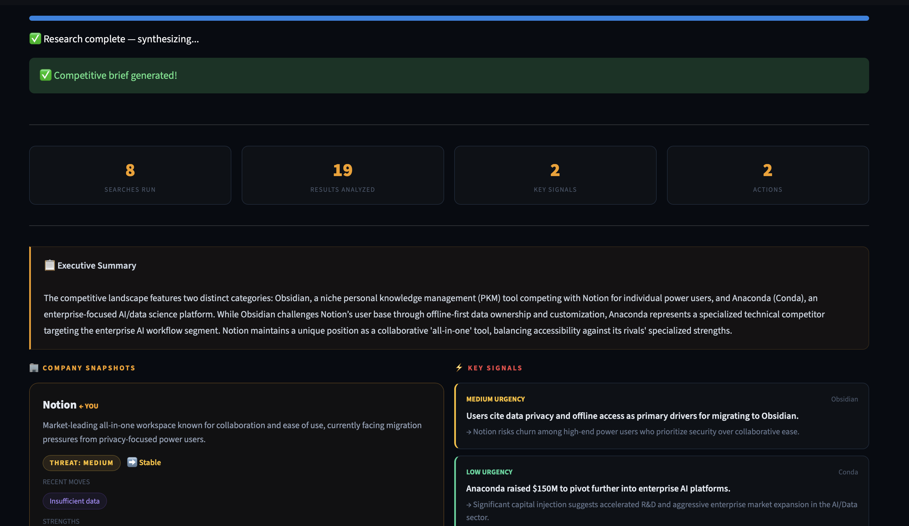

# 🎯 CompeteAI

> Enter your company + competitors →
> an AI agent searches the web in real-time
> and generates a structured competitive brief
> in under 90 seconds.
> Powered by Tavily Search + Gemini 2.0 Flash.


---

## 🎯 Real World Problem

> **Crayon Competitive Intelligence Report, 2024**
> — 77% of businesses say competitive intelligence
> is important, but only 29% do it consistently.
> The gap is time and tooling.
>
> **Global Competitive Intelligence Tools Market,
> 2024** — market valued at $0.56 billion, growing
> at 12.5% CAGR. Tools like Crayon and Kluge cost
> $500–$2000/month — out of reach for most teams.
>
> **McKinsey, 2024** — organizations with real-time
> competitor monitoring report materially shorter
> sales cycles and 33% higher prediction accuracy.

CompeteAI gives any team enterprise-grade
competitive intelligence in 90 seconds — free.

---

## ✨ Features

- 🧠 AI agent plans its own search queries
- 🔍 Real-time web search via Tavily API
- 🔎 Noise filtering — keeps signal, removes noise
- 📊 Company snapshots: threat level + momentum
- ⚡ Key signals with urgency classification
- 🎯 Recommended actions with timeframes
- 👁️ Watch list for ongoing monitoring
- 📋 Executive summary of competitive landscape
- 📈 Market trends across all companies

---

## 🏗️ Architecture
```
User Input (your company + competitors)
          ↓
Step 1 — Query Planner (Gemini)
          Plans 8 strategic search queries
          ↓
Step 2 — Web Researcher (Tavily)
          Executes searches in real-time
          ↓
Step 3 — Filter
          Removes noise, keeps signal
          ↓
Step 4 — Synthesis (Gemini)
          Structures raw results into brief
          ↓
Pydantic Validation → Streamlit Dashboard
```

---

## 🛠️ Tech Stack

| Layer | Tool |
|---|---|
| Agent Planning | Gemini 2.0 Flash |
| Web Search | Tavily Search API |
| Synthesis | Gemini 2.0 Flash |
| Validation | Pydantic |
| UI | Streamlit |
| Language | Python 3.12 |

---

## 🚀 Run Locally
```bash
git clone https://github.com/vedap24/ai-portfolio
cd 06-competeai

source ../venv/bin/activate  # Mac/Linux
..\venv\Scripts\activate     # Windows

pip install -r requirements.txt

# Add both API keys to .env
echo "GEMINI_API_KEY=your_key" >> .env
echo "TAVILY_API_KEY=your_key" >> .env

streamlit run ui.py
```

---

## 📸 Demo




---

## 🧠 What I Learned

- Agents fail in interesting ways — error handling
  around tool calls is more important than
  the happy path
- The planning step is more valuable than
  the execution step — a well-designed query
  plan beats a fast search every time
- BFS graph traversal in DSA maps directly
  to agent exploration — explore all angles
  at depth 1 before going deeper
- Tavily purpose-built for AI agents —
  returns clean structured results without
  HTML noise, unlike raw Google scraping
- Filtering noise before synthesis is critical
  — garbage in = garbage brief

---

## 📅 Day 6 of 14 — AI Build in Public Challenge

Follow the journey →
[LinkedIn](https://linkedin.com/in/vedapraneeth)