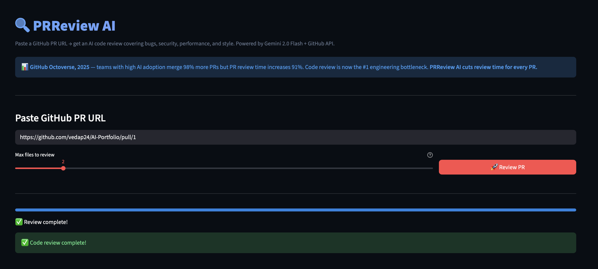
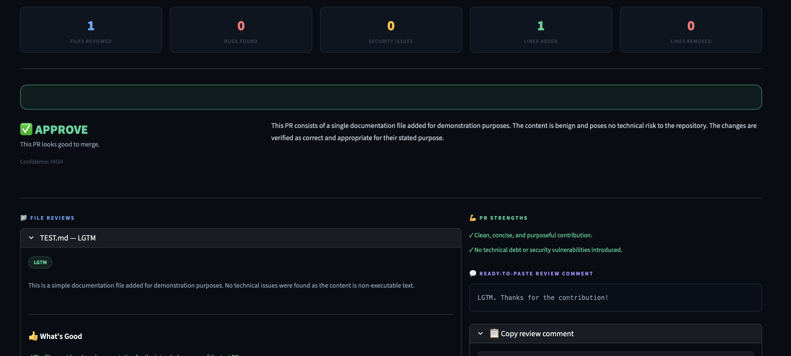

# 🔍 PRReview AI

> Paste a GitHub PR URL → get an AI code review
> covering bugs, security, performance, and style.
> Generates a ready-to-paste GitHub review comment.
> Powered by GitHub API + Gemini 2.0 Flash.


---

## 🎯 Real World Problem

> **GitHub Octoverse, 2025** — teams with high
> AI adoption merge 98% more PRs but PR review
> time increases 91%. Code review is now the
> #1 engineering bottleneck in modern teams.
>
> **Cisco Engineering Blog, 2025** — 18,000
> engineers using AI daily cut their code review
> time in half.
>
> Industry data shows development teams lose
> 20–40% of engineering productivity to
> inefficient code review workflows.

AI is writing more code than ever.
PR volume is exploding.
Senior engineers are drowning in backlogs.
Junior developers wait 2–4 days for feedback
that could come in minutes.

PRReview AI is the first pass reviewer —
catches the obvious bugs so humans can
focus on the architecture decisions.

---

## ✨ Features

- 🐛 Bug detection with severity + line reference
- 🔐 Security issue scanning
  (SQL injection, XSS, hardcoded secrets, etc.)
- ⚡ Performance issue identification
- ✏️ Code style + readability feedback
- 🧪 Missing test coverage suggestions
- 👍 Positive feedback on good patterns
- 💬 Ready-to-paste GitHub review comment
- 📊 Overall verdict:
  APPROVE / REQUEST_CHANGES / NEEDS_DISCUSSION
- ⏭️ Auto-skips lock files and generated files

---

## 🏗️ Architecture
```
GitHub PR URL
      ↓
URL Parser (owner/repo/PR#)
      ↓
GitHub API (PyGitHub)
      ↓
File Diff Parser
  → Skip: lock files, binary, no-diff
  → Truncate: large diffs (3000 chars)
      ↓
Per-file Gemini Review (map pattern)
  → Bugs + Security + Performance + Style
      ↓
PR Summary Synthesis (reduce pattern)
  → Verdict + Top concerns + Comment
      ↓
Pydantic Validation → Streamlit Dashboard
```

---

## 🛠️ Tech Stack

| Layer | Tool |
|---|---|
| GitHub Integration | PyGitHub |
| Diff Parsing | Python (built-in) |
| Code Review | Gemini 2.0 Flash |
| Validation | Pydantic |
| UI | Streamlit |
| Language | Python 3.12 |

---

## 🚀 Run Locally
```bash
git clone https://github.com/vedap24/ai-portfolio
cd 08-prreview-ai

source ../venv/bin/activate  # Mac/Linux
..\venv\Scripts\activate     # Windows

pip install -r requirements.txt

# Add both keys to .env
echo "GEMINI_API_KEY=your_key" >> .env
echo "GITHUB_TOKEN=your_token" >> .env

streamlit run ui.py
```

---

## 📸 Demo



---

## 🧠 What I Learned

- Map-reduce pattern applied to AI:
  map each file to LLM independently,
  reduce all results into one PR summary
- Diff parsing is messier than expected —
  binary files, lock files, and truncation
  all need explicit handling
- Stack data structure (DSA) maps directly
  to code block parsing —
  push on opening brace, pop on closing
- The ready-to-paste comment is the
  highest-value output — it's the one
  thing reviewers actually use
- Always handle GitHub API errors explicitly —
  401, 403, 404 all need different messages

---

## 📅 Day 8 of 14 — AI Build in Public Challenge

Follow the journey →
[LinkedIn](https://linkedin.com/in/vedapraneeth)