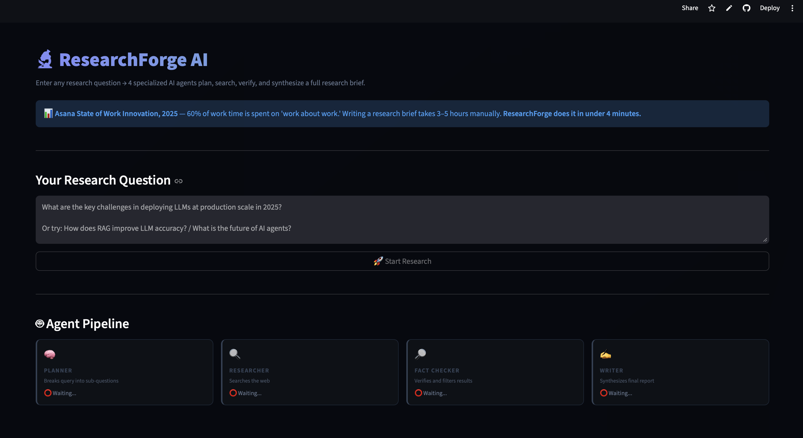

# 🔬 ResearchForge AI

> Enter any research question → 4 specialized
> AI agents plan, search, verify, and synthesize
> a full research brief in under 4 minutes.
> Powered by Tavily Search + Gemini 2.0 Flash.


---

## 🎯 Real World Problem

> **Asana State of Work Innovation, 2025** —
> 60% of work time is spent on "work about work."
> Writing a thorough research brief takes
> 3–5 hours of reading, note-taking,
> cross-referencing, and synthesis.
>
> **Microsoft Work Trend Index, 2025** —
> 53% of leaders say productivity must increase
> while 80% of employees say they lack the time
> or energy to do their work.

ResearchForge compresses 3–5 hours of manual
research into under 4 minutes —
without sacrificing source verification
or structured synthesis.

---

## 🤖 The 4 Agents

| Agent | Job | Why Separate |
|---|---|---|
| Planner | Breaks query into 4 sub-questions | Targeted search > generic search |
| Researcher | Executes web searches via Tavily | Real-time data, not LLM memory |
| Fact Checker | Verifies and filters results | Quality gate before synthesis |
| Writer | Synthesizes verified facts into brief | Only sees clean data |

**Why 4 agents instead of 1 big prompt:**
Each agent has ONE job. Single responsibility
means each step is independently debuggable,
improvable, and replaceable.
This is "separation of concerns"
applied to AI systems.

---

## ✨ Features

- 🧠 Planner breaks query into
  4 targeted sub-questions
- 🔍 Researcher executes real-time web searches
- 🔎 Fact Checker verifies and filters
  with confidence scoring
- ✍️ Writer synthesizes into structured brief
- 📋 Executive summary + key findings +
  detailed sections
- ⚠️ Knowledge gaps explicitly acknowledged
- 💡 Follow-up questions for deeper research
- 📥 Download report as Markdown
- 🔄 Real-time agent status in UI

---

## 🏗️ Architecture
```
User Query
    ↓
[Agent 1: PLANNER]
Query → 4 targeted sub-questions
    ↓
[Agent 2: RESEARCHER]
Sub-questions → Tavily web searches
→ Raw search results
    ↓
[Agent 3: FACT CHECKER]
Raw results → Verified facts
→ Confidence scoring
→ Contradiction detection
    ↓
[Agent 4: WRITER]
Verified facts → Structured report
→ Executive summary
→ Key findings
→ Detailed sections
→ Conclusions
    ↓
Pydantic Validation → Streamlit UI
```

---

## 🛠️ Tech Stack

| Layer | Tool |
|---|---|
| Agent Orchestration | Python (manual state machine) |
| Web Search | Tavily Search API |
| LLM | Gemini 2.0 Flash |
| Validation | Pydantic |
| UI | Streamlit |
| Language | Python 3.12 |

---

## 🚀 Run Locally
```bash
git clone https://github.com/vedap24/ai-portfolio
cd 09-researchforge

source ../venv/bin/activate  # Mac/Linux
..\venv\Scripts\activate     # Windows

pip install -r requirements.txt

# Add both keys to .env
echo "GEMINI_API_KEY=your_key" >> .env
echo "TAVILY_API_KEY=your_key" >> .env

streamlit run ui.py
```

---

## 📸 Demo



---

## 🧠 What I Learned

- 4 focused agents beats 1 giant prompt
  every time — easier to debug,
  better output quality, cleaner architecture
- Dependency injection: passing `call_gemini`
  as a function reference makes agents
  independently testable
- DP optimal substructure (DSA) maps directly
  to agent task decomposition —
  break the problem into sub-problems,
  solve each, combine results
- The Fact Checker is the most valuable agent —
  without it the Writer hallucinates
  from noisy search results
- Manual state machine > framework overhead
  for learning and for interviews

---

## 📅 Day 9 of 14 — AI Build in Public Challenge

Follow the journey →
[LinkedIn](https://linkedin.com/in/vedapraneeth)